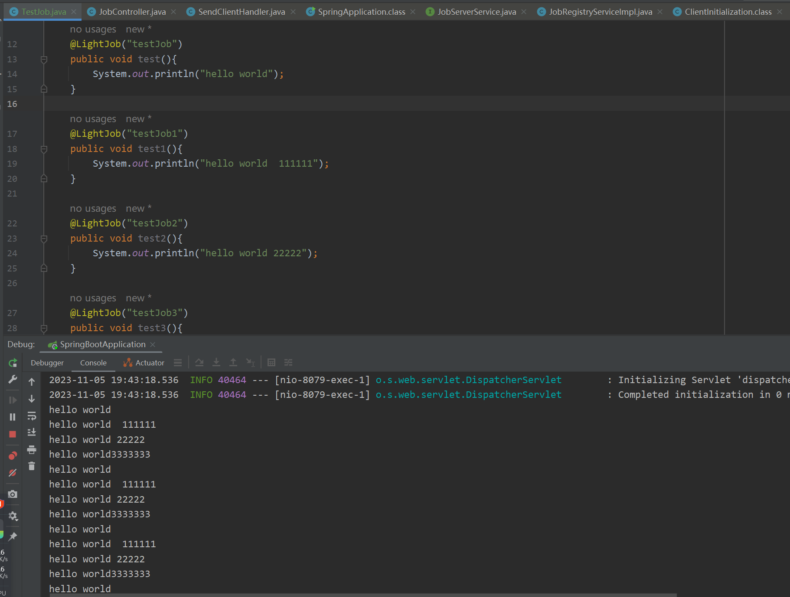

## 轻量级分布式调度中心

- **基本内容**:

  本来使用quartz进行任务调度，但是quartz在集群下会出问题，虽然quartz支持集群模式，但是过于重量级，因此开发分布式调度中心

- **使用方式**:

  配置 light.job.server.domain 为服务端的域名
  客户端依赖job-client，在调度任务的方法上添加LightJob的注解，会进行自动注册
  需要在job_info的表中进行任务管理
- 
